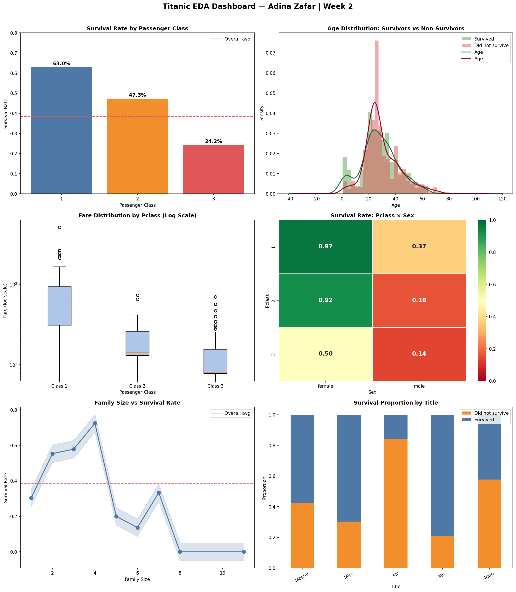

# AI/ML Internship — Week 2
# Titanic Survival EDA & Data Analysis

Name: Adina Zafar  
Week: 2 of 8  
Dataset: Titanic — Machine Learning from Disaster (891 rows, 12 columns)  
Tools: Python, NumPy, Pandas, Matplotlib, Seaborn, Scikit-learn

## Project Overview
This project performs a complete data analysis pipeline on the Titanic dataset, including missing value treatment, outlier detection, feature engineering (7 new 
features), categorical encoding, feature scaling, and exploratory data analysis using GroupBy, pivot tables, and correlation analysis. The final output is a 
cleaned ML-ready dataset and a 6-chart EDA dashboard.

## Top 3 Findings
1. Females survived at 74.2% vs males at only 18.9%, gender was the single strongest predictor
2. First class females had a 96.8% survival rate vs 13.5% for third class males, an 83 point gap
3. Solo travelers survived at only 30.4% vs 50.6% for passengers traveling with family

## EDA Dashboard

